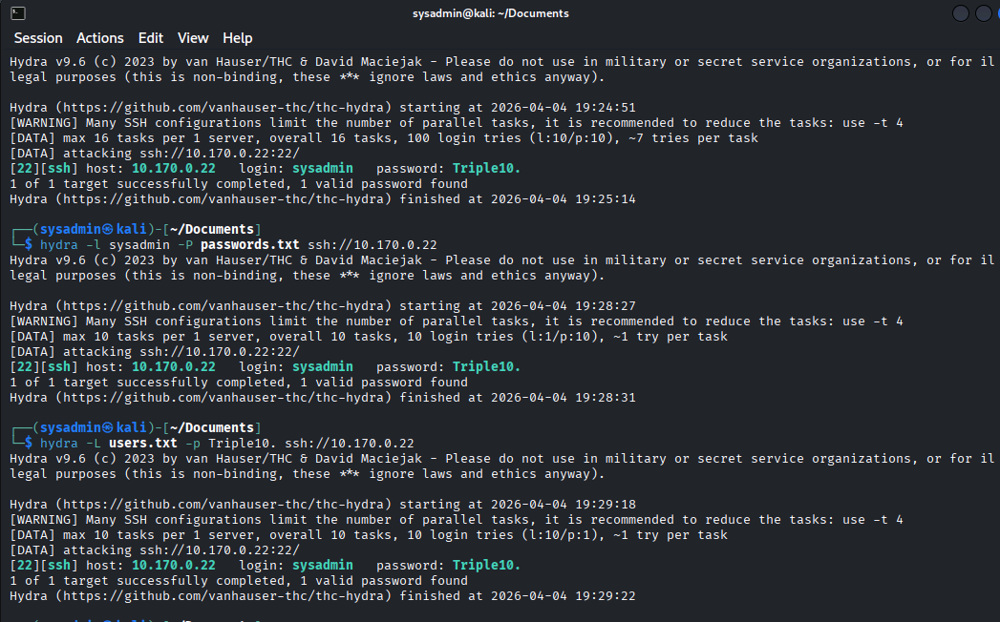
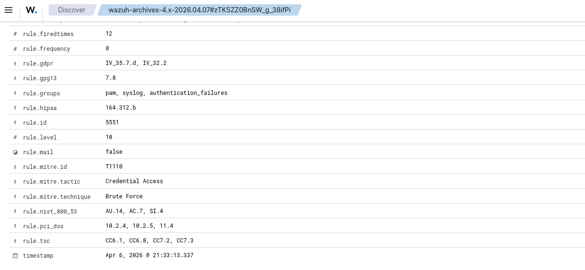
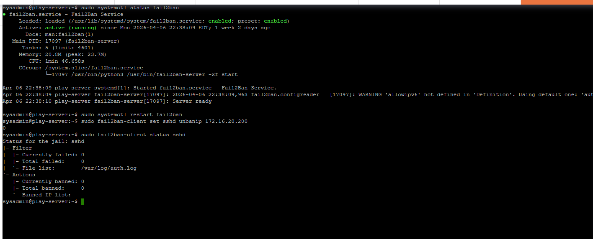
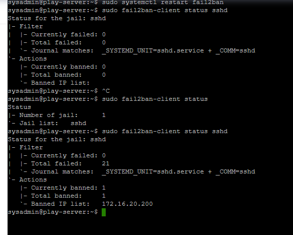
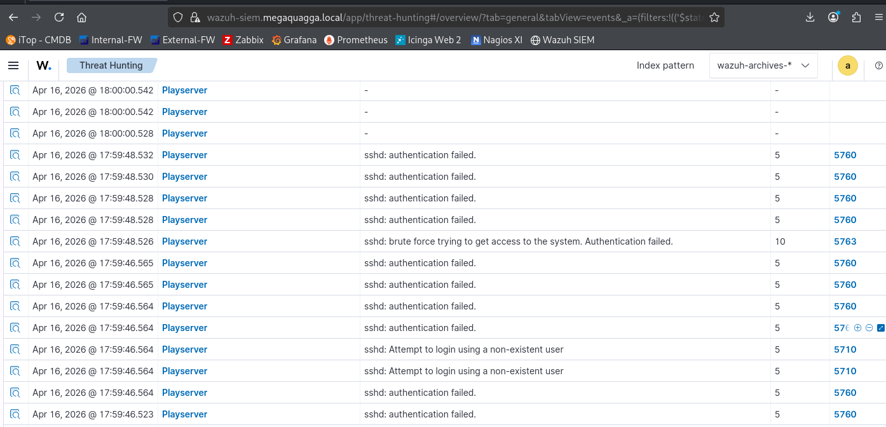

# SIEM Security Monitoring & Incident Response Lab (Wazuh)

>  SOC Incident Simulation: SIEM Monitoring, Brute Force Detection, and Automated Response (Wazuh + Fail2Ban)

---

## Environment Setup (SIEM Monitoring)

The SIEM environment was configured using Wazuh to collect and monitor logs from connected endpoints.

---

## Monitored Endpoint

The target system ("playserver") was successfully integrated into the SIEM environment as a monitored agent.

---

## Attack Simulation (Brute Force)

A brute force attack was simulated using Hydra to generate repeated authentication attempts against the target system.

---

## Detection (Log Analysis & SIEM Alerts)

---

## Response (Fail2Ban Mitigation)

Fail2Ban was configured to monitor authentication failures and enforce automated blocking rules.

The attacking IP was successfully blocked after repeated failed authentication attempts.

---

## Security Outcome

This project demonstrates a full Security Operations Center (SOC) workflow:

- SIEM deployment and configuration (Wazuh)
- Endpoint monitoring and log collection
- Attack simulation (Hydra brute force)
- Detection through log analysis and alerting
- Automated response and mitigation (Fail2Ban)

---

## Outcome
This project reinforced core SOC analyst skills including monitoring security events, interpreting SIEM alerts, and following structured investigation workflows in a simulated enterprise environment.
