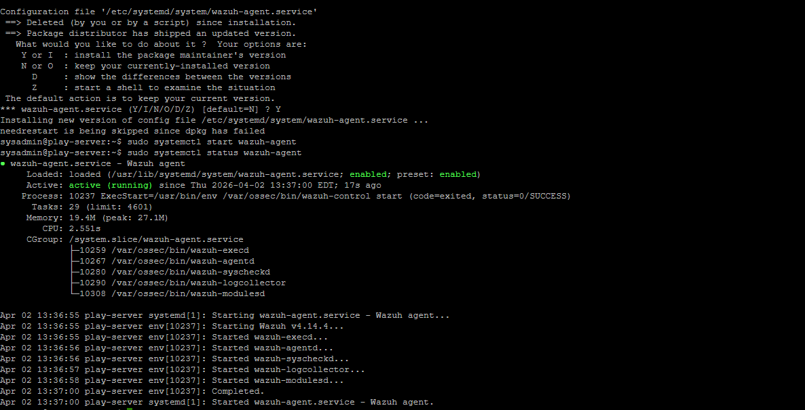
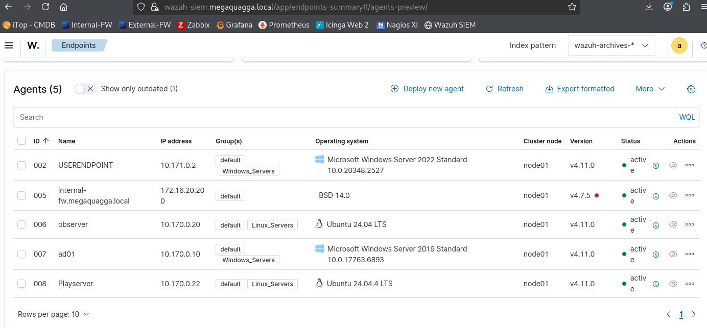

# SIEM Security Monitoring & Incident Response Lab (Wazuh)

> SOC Simulation: Attack Detection, Analysis, and Automated Response

---

## Environment Setup (SIEM Monitoring)

The SIEM environment was configured using Wazuh to collect and monitor logs from connected endpoints.

---

## Monitored Endpoint

The target system ("playserver") was successfully integrated into the SIEM environment as a monitored agent.

---

## Attack Simulation (Brute Force)

A brute force attack was simulated using Hydra to generate repeated authentication attempts against the target system.

---

## Detection (Log Analysis & SIEM Alerts)

!

The system recorded multiple failed login attempts, which were detected and correlated by Wazuh.

---

## Response (Fail2Ban Mitigation)

!

Fail2Ban was configured to monitor authentication failures and enforce automated blocking rules.

!

The attacking IP was successfully blocked after repeated failed authentication attempts.

---

## Security Outcome

This investigation demonstrates a complete SOC workflow:
- SIEM deployment and monitoring
- Attack simulation (brute force)
- Detection through log correlation
- Automated response and mitigation

---

## Outcome
This project reinforced core SOC analyst skills including monitoring security events, interpreting SIEM alerts, and following structured investigation workflows in a simulated enterprise environment.
